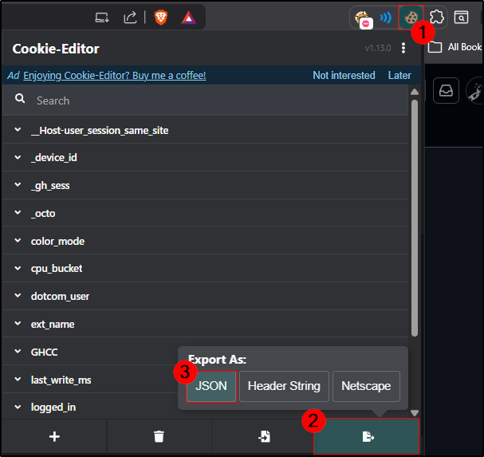

# TryHackMe Streak Automator

A Python proof-of-concept (PoC) that automates maintaining daily streaks on TryHackMe by resetting room progress and submitting answers programmatically.

> ⚠️ This project is intended strictly for educational and security research purposes.

---

## Overview

This project demonstrates how TryHackMe streak activity can be automated using authenticated requests with valid session cookies.

The script:
- Fetches a fresh CSRF token
- Resets room progress
- Submits the correct answer automatically
- Updates the daily streak without manual interaction

Authentication is performed using exported browser cookies from your own account.

---

## Features

- Automatic CSRF token retrieval
- Automated room progress reset
- Automated answer submission
- Colored console output
- Lightweight and simple structure
- Minimal setup required

---

## Requirements

- Python 3.8 or newer
- `requests` library
- Valid TryHackMe session cookies

---

## Installation

### 1. Clone the repository

```bash
git clone https://github.com/yourusername/tryhackme-streak-automator.git
cd tryhackme-streak-automator
```

### 2. Install dependencies
```bash
pip install requests
```

### 3. Export your TryHackMe cookies

> You can use browser extensions such as: Cookie-Editor

**Step 01** - Copy your latest TryHackMe cookies after logging in, as shown in the screenshot below.

<details>
  <summary>Click to expand screenshots</summary>

  <br>

  <p align="center">
    
    <br>
    <em>Export TryHackMe cookies using Cookie-Editor</em>
  </p>

</details>

<p><strong>Step 02</strong> - Add the exported cookies to the <code>core/cookies.data</code> file in JSON format.</p>

## Usage
```bash
python app.py
```
